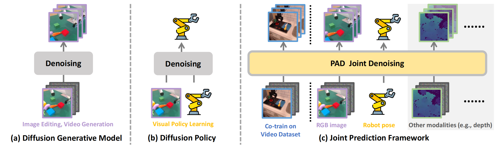

<div align="center">
<h2><center>👉 Prediction with Action: 

Visual Policy Learning via Joint Denoising Process</h2>

[Yanjiang Guo*](), [Yucheng Hu*](), [Jianke Zhang](), [Yen-Jen Wang](), [Xiaoyu Chen](), [Chaochao Lu](), [Jianyu Chen]()


<a href='https://arxiv.org/abs/2411.18179'></a> 
<a href='https://sites.google.com/view/pad-paper'></a> 

</div>



This repo is the official PyTorch implementation for NeurIPS 2024 paper [**Prediction with Action**](https://arxiv.org/abs/2411.18179).

## Friendship Link 🔥

🔥🔥🔥**Dec. 2024:** We are excited to announce our latest work [**Video Prediction Policy: A Generalist Robot Policy with Predictive Visual Representations**](https://video-prediction-policy.github.io/) which is even stronger and faster. Video-Prediction-Policy finetune a video foundation model on manipulation domain with internet maniplation datasets to guide action learning.


##  Installation 🛠️
First, download and set up the repo.

```bash
git clone https://github.com/Robert-gyj/prediction_with_action.git
conda env create -f environment.yml
conda activate PAD
```


If you want to perform experiments in [Metaworld](https://github.com/Farama-Foundation/Metaworld), you need to first install the `Mujoco`. Metaworld is in active developing with different versions of `Mujoco`, we include a older version of Metaworld in codebase based on `mujoco-py==2.0.x/2.1.x`. 
Install Mujoco and metaworld:
```bash
# If you do not want to use metawolrd, you can skip installations below.

# dowload
dowload from https://mujoco.org/download/mujoco210-linux-x86_64.tar.gz
mkdir ~/.mujoco
tar -zxvf mujoco210-linux-x86_64.tar.gz -C ~/.mujoco
# add following lines to the end of ~/.bashrc
export LD_LIBRARY_PATH=$LD_LIBRARY_PATH:/home/{user_name}/.mujoco/mujoco210/bin
export LD_LIBRARY_PATH=$LD_LIBRARY_PATH::/usr/lib/nvidia
source ~/.bashrc

# install mujoco_py
cd ~/.mujoco/mujoco210/bin
pip install mujoco_py==2.1.2.14

# test
import mujoco_py

# After install the Mujoco200/Mujoco210, install Metaworld:
cd metaworld
pip install -e .
```


## CheckPoints 📷
First, download [clip-vit-base-patch32](https://huggingface.co/openai/clip-vit-base-patch32) and [sd-vae-ft-mse](https://huggingface.co/stabilityai/sd-vae-ft-mse) checkpoints from the huggingface. These models are freeze during trainning.

Next, download the PAD checkpoint. For convenience, we offer two types of PAD models for download, depending on your requirements.

| Ckpt name     | Training type | Parameter Num |
|---------------|------------------|---------|
| [bridge-pre](https://huggingface.co/yjguo/pad_bridge_pre/tree/main) | Bridge Dataset Pretrain         | ~670M    |
| [bridge-pre-mw-ft](https://huggingface.co/yjguo/pad_bridge_pre/tree/main) |    Bridge Dataset Pretrain + Metaworld Finetuned      | ~670M    |


**📊 Try Predictions on Bridge:** If you want to make predictions on bridge datasets, download the bridge-pre model.

**📊 Try Rollouts in Metaworld:** If you want to rollout on Metaworld benchmark, download the bridge-pre-mw-ft model.

**🛸 Train PAD in new environments**: If you want to run PAD algorithm in other environments, download the pretrained bridge-pre model and initializa your model with it.


## Evaluation 📊
### 📊 Make future predictions on the Bridge dataset
For your convenience, we put some bridge video samples in the folder `gallery/bridge`. You can visualize predictions by running inference on ckpt [bridge-pre](https://github.com/Robert-gyj/Prediction_with_Action). Remember to reset the `ckpt_path, vae_path, clip_path, sample_name` in `BRIDGE_CONFIG` of `evaluation/run_cfg.py` to your model download locations.

```bash
python evaluation/run_bridge.py
```

After running this command, you can find some outputs in the folder `output/bridge_prediction` which should be simialr to that in `gallery/bridge_prediction`


### 📊 Rollout on Metaworld benchmark
You should install Metaworld as described in installation section and also download the [bridge-pre-mw-ft](https://github.com/Robert-gyj/Prediction_with_Action) ckpt.  Remember to reset the `ckpt_path, vae_path, clip_path` in `META_CONFIG` inside `evaluation/run_cfg.py` to where your model located, also reset the roll tasks `task_list`. All available task names are listed in `INSTRUCTION` inside `evaluation/run_cfg.py`.  After these setup finishes, you can rollout with:

```bash
python evaluation/run_meatworld.py
```

After running this command, you can find some rollout videos in the folder `output/rollout_metaworld` which visualize both the current observations and future predictions. Some video examples are provided in `gallery/rollout_metaworld`.


## Trainning PAD 🛸 


### 🛸 Prepare your datasets
(1) We highly recommand to pre-encode your rgb images and save the corresponding latents, since the VAE encoder is freeze during training and you do not need to encode the same image for many times. This process will save GPU memory cost and reduce training time. We provide an example script in [`extract_features.py`](extract_features.py), you should modify this file to fit your dataset.

(2) Also you need to reimplement the `RobotDataset` class in [`train_robot.py`](train_robot.py) to fit your dataset.

### 🛸 Training requirements
Our experiments are run with batch size 64*4=256 on 4 A800 80G cards. Under this setting, the training process takes ~70G GPU memory and the training speed is ~1.20 ite/s. 

If you have limited GPU memory, you can use `torch.utils.checkpoint.checkpoint` to save GPU memory which sacrifice some training speed. You just need to set the `--ckpt_wrapper` flag in [`exp.sh`](exp.sh) to enable it. Under this setting, the GPU memory can be reduced to ~18G and the training speed slightly decrease to ~0.90 ite/s. 

### 🛸 Training script
We provide two training script for PAD in [`train_robot.py`](train_robot.py) and [`train_cotrain.py`](train_cotrain.py). You can initailiza the model with the pretrained ckpt [bridge-pre](https://github.com/Robert-gyj/Prediction_with_Action) by setting `--rgb_init xxx`.

You can train directly on custemer robot datasets with [`train_robot.py`](train_robot.py). Also, you can cotrain on robot datasets and internet video datasets with [`train_cotrain.py`](train_cotrain.py).


To launch PAD training with multiple GPUs on one node:
```bash
bash exp.sh
```


## Bibtex 
🌟 If you find our work helpful, please leave us a star and cite our paper. Thank you!
```
@article{guo2024prediction,
  title={Prediction with Action: Visual Policy Learning via Joint Denoising Process},
  author={Guo, Yanjiang and Hu, Yucheng and Zhang, Jianke and Wang, Yen-Jen and Chen, Xiaoyu and Lu, Chaochao and Chen, Jianyu},
  journal={arXiv preprint arXiv:2411.18179},
  year={2024}
}